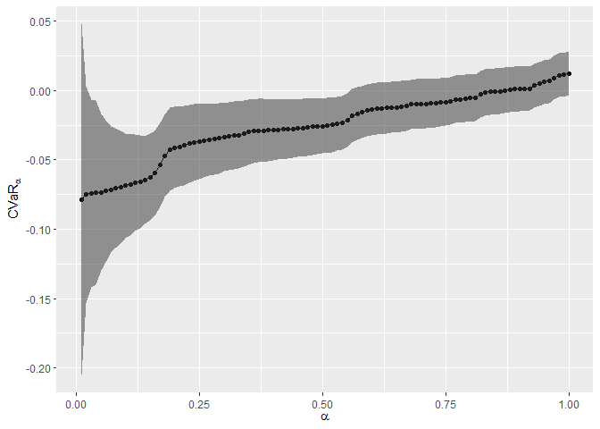
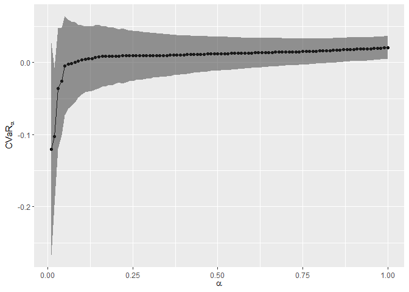
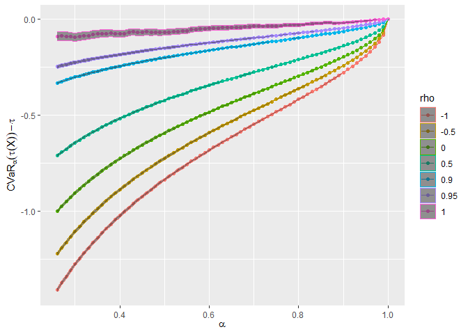
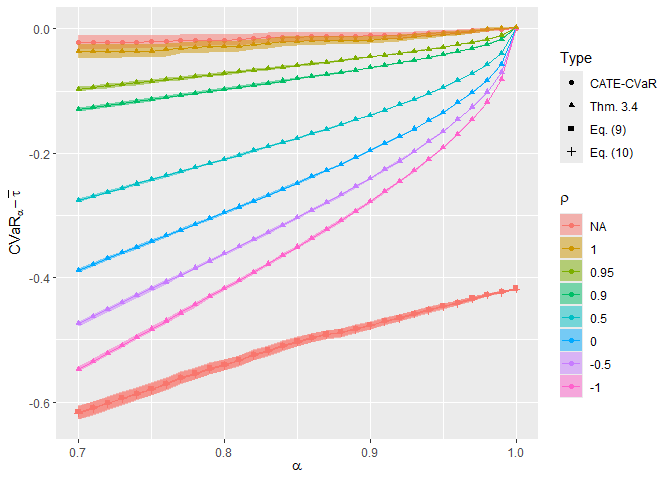
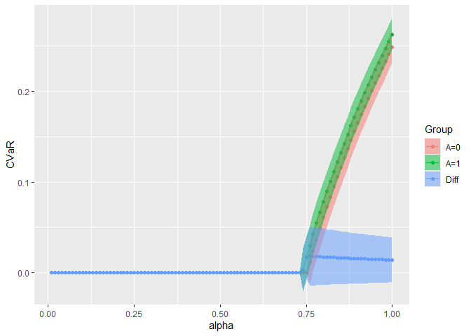

# Data

``` r
knitr::opts_chunk$set(
  warning = F,
  cache = T,
  message = F
)
```

``` r
library(tidyverse)
library(foreach)
library(latex2exp)
library(gbm)
library(cmna)
library(Rearrangement)

job <- read.csv("data/behaghel.csv")

Xbin <- c(
  "College_education",
  "nivetude2",
  "Vocational",
  "High_school_dropout",
  "Manager",
  "Technician",
  "Skilled_clerical_worker",
  "Unskilled_clerical_worker",
  "Skilled_blue_colar",
  "Unskilled_blue_colar",
  "Woman",
  "Married",
  "French",
  "African",
  "Other_Nationality",
  "Paris_region",
  "North",
  "Other_regions",
  "Employment_component_level_1",
  "Employment_component_level_2",
  "Employment_component_missing",
  "Economic_Layoff",
  "Personnal_Layoff",
  "End_of_Fixed_Term_Contract",
  "End_of_Temporary_Work",
  "Other_reasons_of_unemployment",
  "Statistical_risk_level_2",
  "Statistical_risk_level_3",
  "Other_Statistical_risk",
  "Search_for_a_full_time_position",
  "Sensitive_suburban_area",
  "Insertion",
  "Interim",
  "Conseil"
)

Xnum <- c(
  "age",
  "Number_of_children",
  "exper", # years experience on the job
  "salaire.num", # salary target
  "mois_saisie_occ", # when assigned
  "ndem" # Num. unemployment spell
)

Xall <- c(Xbin, Xnum)

# Focus on private vs public

job_binary <- job %>%
  filter(A_public == 1 | A_private == 1) %>%
  mutate(sw = sw / mean(sw)) %>%
  mutate(A = A_public, ipw = 1 / (A_standard * mean(sw * A_standard) + A_private * mean(sw * A_private) + A_public * mean(sw * A_public)))

# Cross fitting

make.cvgroup <- function(n, K, right = TRUE) {
  split <- runif(n)
  return(as.numeric(cut(split, quantile(split, probs = seq(0, 1, 1 / K)), include.lowest = TRUE, right = right)))
}

make.cvgroup.balanced <- function(data, K, form_t) {
  cvgroup <- numeric(nrow(data))
  cvgroup[data[[form_t]] == 1] <- make.cvgroup(sum(data[[form_t]] == 1), K, right = TRUE)
  cvgroup[data[[form_t]] == 0] <- make.cvgroup(sum(data[[form_t]] == 0), K, right = FALSE)
  return(cvgroup)
}

set.seed(0)

K <- 5
cvgroup <- job_binary %>% make.cvgroup.balanced(., K, "A")

mu0.pred <- numeric(nrow(job_binary))
mu1.pred <- numeric(nrow(job_binary))
tau.pred <- predict(lm(formula = as.formula(paste("(2*A-1)*ipw*Y ~ (", paste(Xall, collapse = " + "), ")")), data = job_binary, weights = job_binary$sw))
```

# Estimation

``` r
set.seed(0)

K <- 5
cvgroup <- job_binary %>% make.cvgroup.balanced(., K, "A")

mu0.pred <- numeric(nrow(job_binary))
mu1.pred <- numeric(nrow(job_binary))
tau.pred <- predict(lm(formula = as.formula(paste("(2*A-1)*ipw*Y ~ (", paste(Xall, collapse = " + "), ")")), data = job_binary, weights = job_binary$sw))

for (k in 1:K) {
  print(k)
  fmu0 <- gbm(
    formula = as.formula(paste("Y ~ (", paste(Xall, collapse = " + "), ")")),
    data = job_binary[cvgroup != k & job_binary$A == 0, ],
    weights = job_binary[cvgroup != k & job_binary$A == 0, "sw"],
    distribution = "bernoulli",
    cv.folds = 4
  )
  fmu1 <- gbm(
    formula = as.formula(paste("Y ~ (", paste(Xall, collapse = " + "), ")")),
    data = job_binary[cvgroup != k & job_binary$A == 1, ],
    weights = job_binary[cvgroup != k & job_binary$A == 1, "sw"],
    distribution = "bernoulli",
    cv.folds = 4
  )
  mu0.pred[cvgroup == k] <- predict(fmu0, job_binary[cvgroup == k, ], n.trees = gbm.perf(fmu0, method = "cv", plot.it = F), type = "response")
  mu1.pred[cvgroup == k] <- predict(fmu1, job_binary[cvgroup == k, ], n.trees = gbm.perf(fmu1, method = "cv", plot.it = F), type = "response")
}
```

    [1] 1
    [1] 2
    [1] 3
    [1] 4
    [1] 5

``` r
job_binary <- job_binary %>% mutate(
  tau = tau.pred,
  mu0 = mu0.pred,
  mu1 = mu1.pred
)

var0.pred <- numeric(nrow(job_binary))
var1.pred <- numeric(nrow(job_binary))
for (k in 1:K) {
  print(k)
  fvar <- gbm(
    formula = as.formula(paste("(Y-mu0)^2 ~ (A + ", paste(Xall, collapse = " + "), ")")),
    data = job_binary[cvgroup != k, ],
    weights = job_binary[cvgroup != k, "sw"],
    distribution = "gaussian",
    cv.folds = 4
  )
  var0.pred[cvgroup == k] <- predict(fvar, job_binary[cvgroup == k, ] %>% mutate(A = 0), n.trees = gbm.perf(fvar, method = "cv", plot.it = F), type = "response")
  var1.pred[cvgroup == k] <- predict(fvar, job_binary[cvgroup == k, ] %>% mutate(A = 1), n.trees = gbm.perf(fvar, method = "cv", plot.it = F), type = "response")
}
```

    [1] 1
    [1] 2
    [1] 3
    [1] 4
    [1] 5

``` r
job_binary <- job_binary %>% mutate(
  var0 = var0.pred * (var0.pred > 0),
  var1 = var1.pred * (var1.pred > 0)
)

job_binary <- job_binary %>% mutate(
  var0 = var0.pred * (var0.pred > 0),
  var1 = var1.pred * (var1.pred > 0)
)

correction1 <- job_binary %>%
  summarise(mean(sw * (sqrt(var0) + sqrt(var1)))) %>%
  pull()
Rsquared <- job_binary %>%
  group_by(A) %>%
  summarise(condvar = mean(sw * (Y - A * mu1 - (1 - A) * mu0)^2), marvar = mean(sw * Y))
correction2 <- Rsquared %>%
  summarise(sum(sqrt(condvar))) %>%
  pull()

wtdquantile <- function(y, w, g) {
  if (g >= 1) {
    max(y)
  } else {
    o <- order(y)
    y[o[which(cumsum(w[o]) >= sum(w) * g)[1]]]
  }
}
ps <- seq(0.01, 1, 0.01)

zz <- 1.64485
```

# Fig 1

``` r
CVaR <- foreach(p = ps, .combine = rbind) %do% {
  q <- wtdquantile(job_binary$tau, job_binary$sw, p)
  job_binary %>%
    mutate(IF = q + (mu1 - mu0 + (2 * A - 1) * ipw * (Y - A * mu1 - (1 - A) * mu0) - q) * (tau <= q) / p) %>%
    summarise(p = p, CVaR = mean(sw * IF, na.rm = T), CVaR.se = sd(sw * IF, na.rm = T) / sqrt(n()))
}
job_cvar <- CVaR %>%
  mutate(CVaR = rearrangement(list(ps), CVaR, n = 1000)) %>%
  ggplot() + aes(x = p, y = CVaR, ymax = CVaR + zz * CVaR.se, ymin = CVaR - zz * CVaR.se) + geom_line() + geom_point() + geom_ribbon(alpha = 0.5) + ylab(TeX("${CVaR}_{\\alpha}$")) + xlab(TeX("$\\alpha$"))
job_cvar
```



# Fig 2

``` r
job_cvar_notrearranged <- CVaR %>% ggplot() + aes(x = p, y = CVaR, ymax = CVaR + zz * CVaR.se, ymin = CVaR - zz * CVaR.se) + geom_line() + geom_point() + geom_ribbon(alpha = 0.5) + ylab(TeX("${CVaR}_{\\alpha}$")) + xlab(TeX("$\\alpha$"))
job_cvar_notrearranged
```


# Fig 3

``` r
CVaR.plugin <- foreach(p = ps, .combine = rbind) %do% {
  q <- wtdquantile(job_binary$tau, job_binary$sw, p)
  job_binary %>%
    mutate(IF = q + (tau - q) * (tau <= q) / p) %>%
    summarise(p = p, CVaR = mean(sw * IF, na.rm = T), CVaR.se = sd(sw * IF, na.rm = T) / sqrt(n()))
}
job_cvar.plugin <- CVaR.plugin %>% ggplot() + aes(x = p, y = CVaR, ymax = CVaR + zz * CVaR.se, ymin = CVaR - zz * CVaR.se) + geom_line() + geom_point() + geom_ribbon(alpha = 0.5) + ylab(TeX("${CVaR}_{\\alpha}$")) + xlab(TeX("$\\alpha$"))
job_cvar.plugin
```


# Fig 4

``` r
Xbad <- c("age", "Paris_region", "African", "High_school_dropout")
tau.bad.pred <- predict(lm(formula = as.formula(paste("(2*A-1)*ipw*Y ~ (", paste(Xbad, collapse = " + "), ")")), data = job_binary, weights = job_binary$sw))
job_binary <- job_binary %>% mutate(
  tau.bad = tau.bad.pred,
)
CVaR.bad <- foreach(p = ps, .combine = rbind) %do% {
  q <- wtdquantile(job_binary$tau.bad, job_binary$sw, p)
  job_binary %>%
    mutate(IF = q + (mu1 - mu0 + (2 * A - 1) * ipw * (Y - A * mu1 - (1 - A) * mu0) - q) * (tau.bad <= q) / p) %>%
    summarise(p = p, CVaR = mean(sw * IF, na.rm = T), CVaR.se = sd(sw * IF, na.rm = T) / sqrt(n()))
}
job_cvar.bad <- CVaR.bad %>%
  mutate(CVaR = rearrangement(list(ps), CVaR, n = 1000)) %>%
  ggplot() + aes(x = p, y = CVaR, ymax = CVaR + zz * CVaR.se, ymin = CVaR - zz * CVaR.se) + geom_line() + geom_point() + geom_ribbon(alpha = 0.5) + ylab(TeX("${CVaR}_{\\alpha}$")) + xlab(TeX("$\\alpha$"))
job_cvar.bad
```



# Fig 5

``` r
CVaRmATE <- foreach(p = ps, .combine = rbind) %do% {
  q <- wtdquantile(job_binary$tau, job_binary$sw, p)
  job_binary %>%
    mutate(IF = q + (mu1 - mu0 + (2 * A - 1) * ipw * (Y - A * mu1 - (1 - A) * mu0)) * ((tau <= q) / p - 1) - q * (tau <= q) / p) %>%
    summarise(p = p, CVaR = mean(sw * IF, na.rm = T), CVaR.se = sd(sw * IF, na.rm = T) / sqrt(n()))
}
job_cvarvsate <- CVaRmATE %>%
  mutate(CVaR = rearrangement(list(ps), CVaR, n = 1000)) %>%
  ggplot() + aes(x = p, y = CVaR, ymax = CVaR + zz * CVaR.se, ymin = CVaR - zz * CVaR.se) + geom_line() + geom_point() + geom_ribbon(alpha = 0.5) + ylab(TeX("${CVaR}_{\\alpha}-\\bar{\\tau}$")) + xlab(TeX("$\\alpha$"))
job_cvarvsate
```


# Fig 6

``` r
bs <- seq(0, .25, .05)
CVaR.bbound.mATE <- foreach(p = ps, .combine = rbind) %do% {
  foreach(b = bs, .combine = rbind) %do% {
    q <- wtdquantile(c(job_binary$tau + b, job_binary$tau - b), c(job_binary$sw, job_binary$sw), p)
    job_binary %>%
      mutate(IF = -(mu1 - mu0 + (2 * A - 1) * ipw * (Y - A * mu1 - (1 - A) * mu0)) + q + (mu1 - mu0 + (2 * A - 1) * ipw * (Y - A * mu1 - (1 - A) * mu0) - q - b) * (tau - b <= q) / 2 / p + (mu1 - mu0 + (2 * A - 1) * ipw * (Y - A * mu1 - (1 - A) * mu0) - q + b) * (tau + b <= q) / 2 / p) %>%
      summarise(p = p, b = b, CVaR = mean(sw * IF, na.rm = T), CVaR.se = sd(sw * IF, na.rm = T) / sqrt(n()))
  }
}
CVaR.bbound.mATE %>%
  mutate(b = as.factor(b)) %>%
  group_by(b) %>%
  mutate(CVaR = rearrangement(list(ps), CVaR, n = 1000)) %>%
  ggplot() + aes(x = p, y = CVaR, ymax = CVaR + zz * CVaR.se, ymin = CVaR - zz * CVaR.se, color = b, fill = b) + geom_line() + geom_point() + geom_ribbon(alpha = 0.5) + ylab("CVaR") + xlab("alpha")
```


``` r
job_bounded_bounds <- rbind(
  CVaRmATE %>% mutate(b = "NA", Type = "CATE-CVaR"),
  CVaR.bbound.mATE %>% filter(b > 0) %>% mutate(Type = "Thm. 3.2"),
  foreach(b = bs, .combine = rbind) %do%
    {
      CVaRmATE %>% mutate(CVaR = (CVaR - b) * (p < 1), b = b, Type = "Thm. 3.3")
    } %>% filter(b > 0)
) %>%
  mutate(
    Type = factor(Type, levels = c("CATE-CVaR", "Thm. 3.2", "Thm. 3.3")),
    b = factor(b, levels = c("NA", bs[bs > 0]))
  ) %>%
  group_by(b, Type) %>%
  mutate(CVaR = rearrangement(list(ps), CVaR, n = 1000)) %>%
  ggplot() + aes(x = p, y = CVaR, ymax = CVaR + zz * CVaR.se, ymin = CVaR - zz * CVaR.se, color = b, fill = b, shape = Type) + geom_line() + geom_point() + geom_ribbon(alpha = 0.5, color = NA) + ylab(TeX("${CVaR}_{\\alpha}-\\bar{\\tau}$")) + xlab(TeX("$\\alpha$"))
job_bounded_bounds
```


# Fig 7

``` r
totvar <- Rsquared %>%
  summarise(sum(condvar)) %>%
  pull()
job_binary <- job_binary %>% mutate(sdprod01 = sqrt(var0 * var1), varsum01 = var0 + var1)
rhos <- c(-1, -0.5, 0, 0.5, 0.9, 0.95, 1)
CVaR.sbound.mATE <- foreach(p = ps, .combine = rbind) %do% {
  foreach(rho = rhos, .combine = rbind) %do% {
    q <- goldsectmax(
      function(beta) {
        (job_binary %>% summarise(beta + mean(sw * (tau - beta - sqrt((tau - beta)^2 + varsum01 - 2 * rho * sdprod01))) / (2 * p)) %>% pull())
      },
      min(job_binary$tau) - 5 * totvar / max(p, .01),
      max(job_binary$tau) + 5 * totvar / max(1. - p, .01),
      tol = 1e-4, m = 1e3
    )
    job_binary %>%
      mutate(IF = -(mu1 - mu0 + (2 * A - 1) * ipw * (Y - A * mu1 - (1 - A) * mu0)) + q + (tau - q - sqrt((tau - q)^2 + varsum01 - 2 * rho * sdprod01)) / (2 * p) + (1 - (tau - q) / sqrt((tau - q)^2 + varsum01 - 2 * rho * sdprod01)) * (2 * A - 1) * ipw * (Y - A * mu1 - (1 - A) * mu0) / (2 * p)) %>%
      summarise(p = p, rho = rho, CVaR = mean(sw * IF, na.rm = T), CVaR.se = sd(sw * IF, na.rm = T) / sqrt(n()))
  }
}
CVaR.sbound.mATE %>%
  mutate(rho = as.factor(rho)) %>%
  filter(p > .25) %>%
  ggplot() + aes(x = p, y = CVaR, ymax = CVaR + zz * CVaR.se, ymin = CVaR - zz * CVaR.se, color = rho) + geom_line() + geom_point() + geom_ribbon(alpha = 0.5) + ylab(TeX("${CVaR}_{\\alpha}(\\tau(X))-\\bar\\tau$")) + xlab(TeX("$\\alpha$"))
```



# Fig 8

``` r
job_condvar_bounds <- rbind(
  CVaRmATE %>% mutate(rho = "NA", type = "CATE-CVaR"),
  CVaRmATE %>% mutate(rho = "NA", type = "Eq. (9) bound", CVaR = CVaR - correction1 / (2 * p)),
  CVaRmATE %>% mutate(rho = "NA", type = "Eq. (10) bound", CVaR = CVaR - correction2 / (2 * p)),
  CVaR.sbound.mATE %>% mutate(type = "Thm. 3.4 bound")
) %>%
  mutate(
    Type = factor(type, levels = c("CATE-CVaR", "Thm. 3.4 bound", "Eq. (9) bound", "Eq. (10) bound"), labels = c("CATE-CVaR", "Thm. 3.4", "Eq. (9)", "Eq. (10)")),
    Correlation = factor(rho, levels = c("NA", rev(rhos)))
  ) %>%
  group_by(rho, type) %>%
  mutate(CVaR = rearrangement(list(ps), CVaR, n = 1000)) %>%
  filter(p >= .7) %>%
  ggplot() + aes(x = p, y = CVaR, ymax = CVaR + zz * CVaR.se, ymin = CVaR - zz * CVaR.se, color = Correlation, fill = Correlation, shape = Type) + geom_line() + geom_point() + geom_ribbon(alpha = 0.5, color = NA) +
  ylab(TeX("${CVaR}_{\\alpha}-\\bar{\\tau}$")) + xlab(TeX("$\\alpha$")) +
  guides(shape = guide_legend(title = "Type", order = 1)) + guides(color = guide_legend(title = TeX("$\\rho$"), order = 2), fill = guide_legend(title = TeX("$\\rho$"), order = 2))
job_condvar_bounds
```



# Fig 9

``` r
CVaR.TE <- job_binary %>%
  summarise(mu1 = mean(sw * A * ipw * Y), se1 = sd(sw * A * ipw * Y) / sqrt(n()), mu0 = mean(sw * (1 - A) * ipw * Y), se0 = sd(sw * (1 - A) * ipw * Y) / sqrt(n())) %>%
  merge(x = ., y = tibble(p = ps), all = True) %>%
  mutate(cvar1 = (p > 1 - mu1) * (mu1 - (1 - p)) / p, cvar1.se = (p > 1 - mu1) * se1 / p, cvar0 = (p > 1 - mu0) * (mu0 - (1 - p)) / p, cvar0.se = (p > 1 - mu0) * se1 / p) %>%
  mutate(cvar.te = cvar1 - cvar0, cvar.te.se = sqrt(cvar1.se^2 + cvar0.se^2))

job_cvar_te <- rbind(
  CVaR.TE %>% mutate(cvar = cvar1, cvar.se = cvar1.se, Group = "A=1"),
  CVaR.TE %>% mutate(cvar = cvar0, cvar.se = cvar0.se, Group = "A=0"),
  CVaR.TE %>% mutate(cvar = cvar.te, cvar.se = cvar.te.se, Group = "Diff")
) %>% ggplot() + aes(x = p, y = cvar, ymax = cvar + zz * cvar.se, ymin = cvar - zz * cvar.se, color = Group, fill = Group) + geom_line() + geom_point() + geom_ribbon(alpha = 0.5, color = NA) + ylab("CVaR") + xlab("alpha")
job_cvar_te
```


